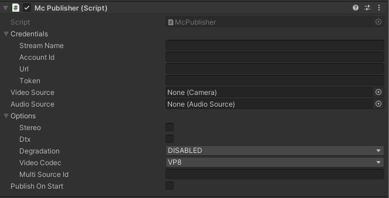

# Understanding the Publisher and Subscriber scripts

### Overview
Unity contains components called scripts,  similar movie scripts, which are code that can be attached to entities that make them behave in a certain way. The Millicast Unity SDK contains two such scripts, one called McPublisher and the other called McSubscriber, which we can use to publish and subscribe to streams from the Millicast Service.  

An example use case is attaching a publisher to your main character, and publishing their first person view and microphone input for other viewers. With that in mind, let us first start with the publisher.

### The Millicast Publisher (or McPublisher) script
The publisher script requires the users to set the following before publishing: 
* A video source, which is a Camera  and/or an audio source, which is Unity's AudioSource, and  
* the publishing credentials, namely the stream name and publishing token, via Credentials, and  
* optionally, certain options like the video codec to be used while publishing, via PublisherOptions.

For more information regarding the API and its usage info, please refer to the documentation [here](https://cosmosoftware.github.io/unity-millicast-rts/Documentation/html/index.html).

With that in mind, the publisher can be utilised in two ways, which will be discussed below:

#### Instantiating the Unity editor as a component

Users can add a Millicast publisher to their entities without having to write code, if they choose to do so:


Once that is done, as stated above, we need to provide the credentials as well the audio and video sources to stream via the inspector UI. We also need to tick the Publish on Start  option since that will allow us to publish as soon as the script starts (when we hit the play button in the scene):



You will need an existing **Camera** and **AudioSource**  to publish. 
The AudioSource can come from anywhere, and can be generated from a microphone input as well. However, as stated in the unity microphone documentation here, the microphone class can only be instantiated within a script. 

Users can optionally select certain options, like the video codec to be used while publishing, which is set to VP8 by default.

### Using the AudioListener as an audio input

You can also use Unity's AudioListener entity (which comes with the main camera) as an audio input to the publisher. This allows a publisher script **attached to the main camera** to stream audio that the camera component is picking up, which can be used for example to stream what your main character hears. For that to work, you need the publisher script to be added to the main camera, and tick the Use Audio Listener As Source  option from the UI: 


You can also do that from within a script via:
```
// publisher is an McPublisher instantiated somewhere
// publisher needs to be a component within an object that contains an AudioListener (like the main camera)
publisher.SetAudioListenerAsSource()
```
Scripting will be elaborated more in the following section: 

### Next Section:  
* [Instantiating RTS within a script](content/unity-streaming/scripting-rts.md)